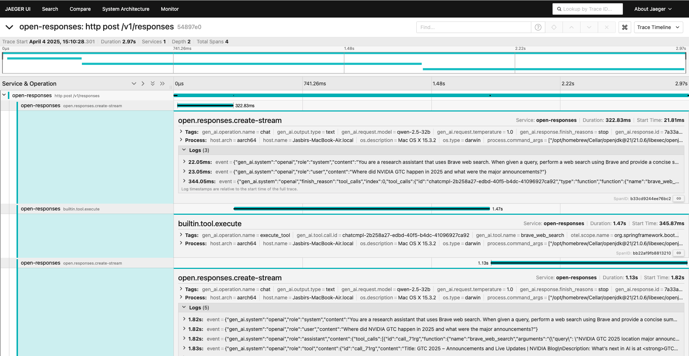
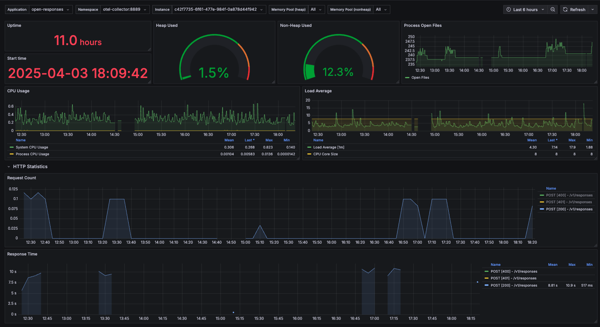

# Observability in Open Responses

This document provides an overview of the observability features in the Open Responses project. The system is instrumented to collect telemetry data across multiple dimensions, enabling monitoring and debugging of AI model interactions.

## Production-Grade Observability Out of the Box

**Open Responses delivers enterprise-level observability from day one, with zero configuration required.**

- **Launch and Monitor**: Start tracking critical GenAI metrics the moment your service goes live
- **No Instrumentation Burden**: Skip weeks of custom instrumentation work with pre-built telemetry
- **Immediate Insights**: Gain instant visibility into model performance, token usage, and system health
- **Scale with Confidence**: Production-ready monitoring that grows with your deployment

Open Responses empowers teams to focus on building AI-powered applications while maintaining the operational visibility required for mission-critical systems.

## Overview

Open Responses uses OpenTelemetry standards to instrument:

1. Model API calls across all providers
2. Built-in tool executions
3. Message content (user, system, assistant, and choices)
4. Token usage metrics
5. Performance metrics for various operations

## Key Components

The primary component responsible for telemetry is the `TelemetryService` located at:

```kotlin
src/main/kotlin/ai/masaic/openresponses/api/support/service/TelemetryService.kt
```

This service provides methods to:
- Create and manage observations (spans)
- Record metrics
- Emit GenAI-specific events
- Track token usage

## Metrics

You can view the collected metrics via the Spring Actuator endpoint: `http://localhost:8080/actuator/metrics`

The system produces the following key metrics:

| Metric Name | Description |
|------------|-------------|
| `builtin.tool.execute` | Measures tool execution performance |
| `gen_ai.client.operation.duration` | Tracks duration of model API calls |
| `gen_ai.client.token.usage` | Counts input and output token usage |
| `open.responses.create` | Measures non-streaming response generation time |
| `open.responses.createStream` | Measures streaming response generation time |

## Traces

The system creates traces for:

1. HTTP POST requests to `/v1/responses`
2. Model response generation via `open.responses.create`
3. Built-in tool execution via `builtin.tool.execute`
4. Streaming response generation via `open.responses.createStream`

## How to Export Telemetry Data

Open Responses is designed to work with the OpenTelemetry ecosystem for exporting telemetry data to various backends.

### Setting Up the OpenTelemetry Collector

1. To enable the OpenTelemetry collector integration, start the service with:
   ```
   spring.profiles.active=otel
   ```

2. The OpenTelemetry collector collects data from the service using OTLP (OpenTelemetry Protocol) over gRPC or HTTP.

3. Configuration of the collector is done via its config file, typically located in the deployment environment.

### Exporting to Monitoring Tools

The collected data can be shipped to various monitoring tools:

- **For Metrics**: Prometheus and Grafana
- **For Traces**: Jaeger, Zipkin, or other tracing backends
- **For Logs**: Various log aggregation systems


## Observability in Action

Below are some examples of the observability insights available in Open Responses:

### Distributed Tracing with Conversation Logs

The following image shows distributed tracing of a Brave search agent with streaming, including the complete conversation logs:



### GenAI Performance Metrics

This dashboard displays token usage and model performance metrics:


### System Health Monitoring

Monitor the overall health and performance of your Open Responses service:



## Standard Metrics

In addition to GenAI-specific observability, Open Responses emits standard Spring Boot metrics, including:

- JVM statistics (memory usage, garbage collection)
- HTTP request metrics (response times, error rates)
- System metrics (CPU usage, disk I/O)
- Logging metrics
- Thread pool statistics

These metrics provide a holistic view of the application's performance beyond just the AI model interactions.

## OpenTelemetry Compatibility

The built-in observability system in Open Responses is highly flexible and compatible with any OpenTelemetry-compliant tool. This allows you to:

- Use SigNoz, Jaeger, or Dynatrace for distributed tracing
- Implement Prometheus and Grafana for metrics and dashboards
- Integrate with OpenTelemetry-compatible GenAI evaluation stacks like LangFuse

This flexibility ensures that Open Responses can fit into your existing observability infrastructure without requiring proprietary monitoring solutions.

## OpenTelemetry Compliance

The implementation follows OpenTelemetry specifications for:

- Spans: [GenAI Agent Spans](https://opentelemetry.io/docs/specs/semconv/gen-ai/gen-ai-agent-spans/)
- Metrics: [GenAI Metrics](https://opentelemetry.io/docs/specs/semconv/gen-ai/gen-ai-metrics/)
- Events: [GenAI Events](https://opentelemetry.io/docs/specs/semconv/gen-ai/gen-ai-events/)

This ensures compatibility with standard observability tools and dashboards that support OpenTelemetry.
